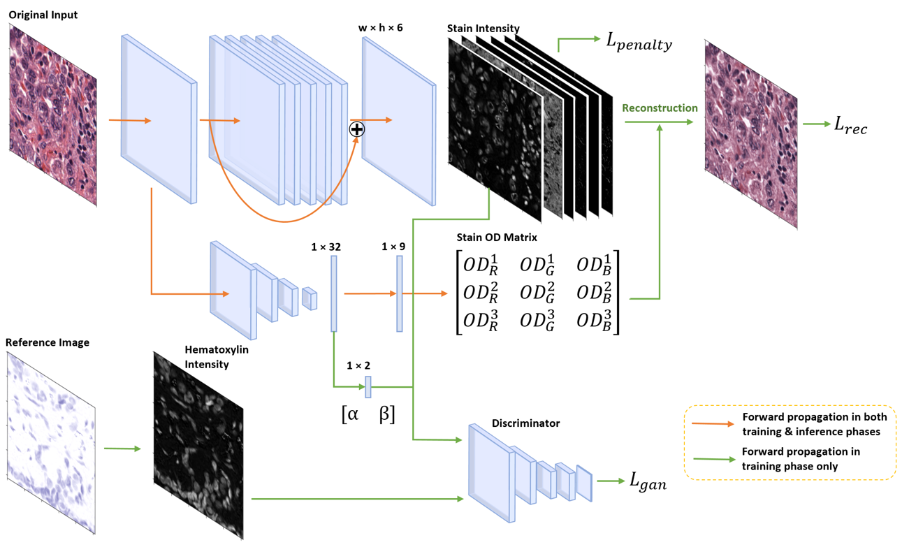
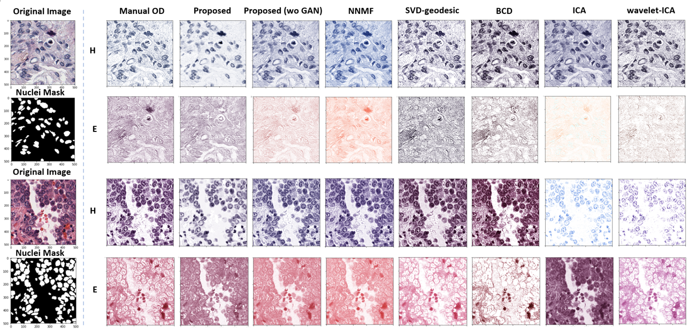

# deconvGAN

A deep learning based unsupervised stain color deconvolution algorithm

## Structure

## Performance

## Files

_You can use https://nbviewer.jupyter.org/ and paste the .ipynb link into it if Girhub does not render the file properly_

### To train deconvGAN

1\) Train deconv-GAN-512-40X wo-GAN.ipynb

### To apply and evaluate deconvGAN

2\) Evaluate deconv-GAN-512-40X.ipynb

### Other stain deconvolution algorithms implemented

* NNMF
* ICA
* BCD
* SVD-geodesic
* waveletICA

## Citation

_Temporarily unavailable_
